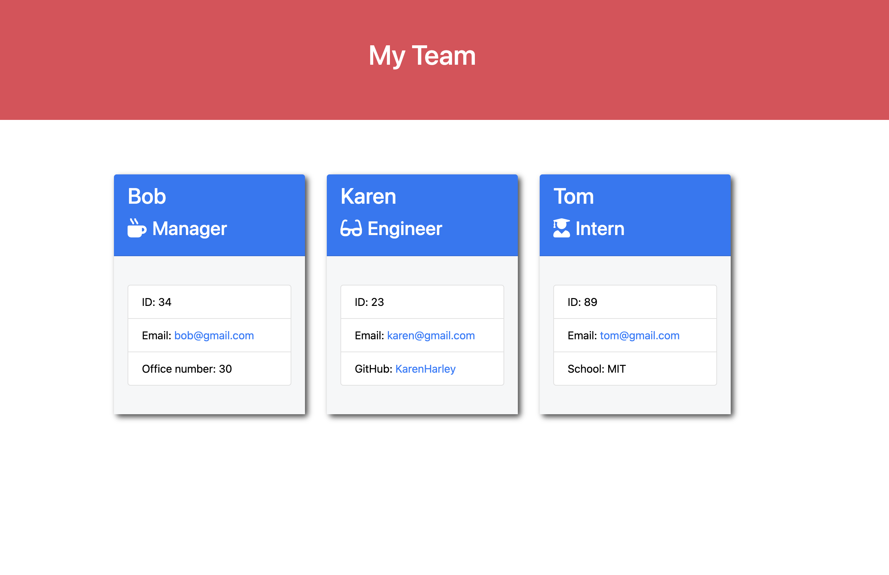
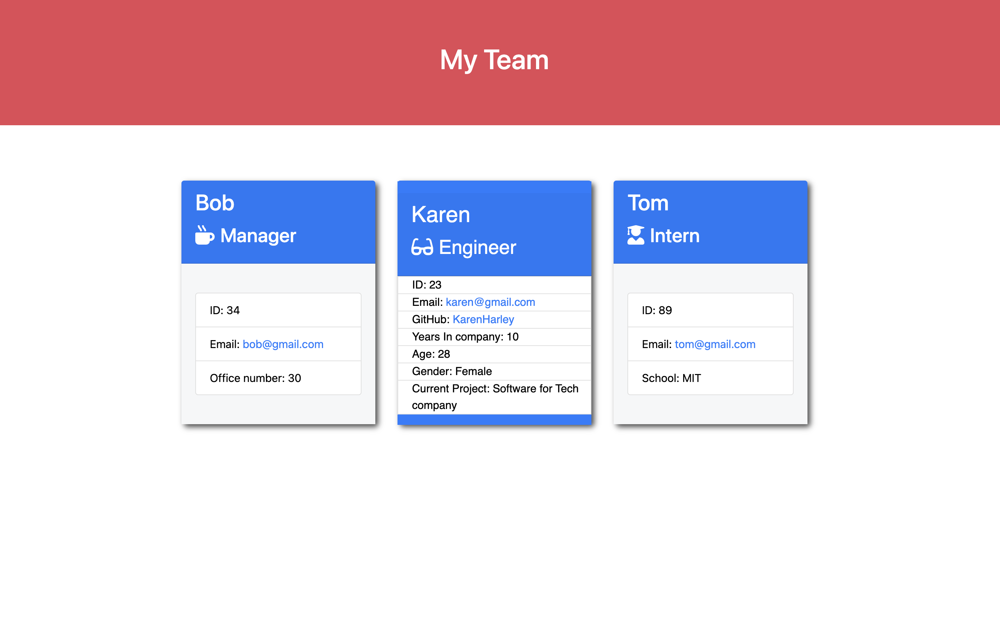

[](https://github.com/DAVFoundation/captain-n3m0/blob/master/LICENSE)

# Team-Profile-Generator
This is Node.js command-line application that takes in information about employees on a software engineering team, then generates an HTML webpage that displays summaries for each person. 

***Note***

The instuctional staff posted the solution as a mistake but instucted me to add additional functionality to the already completed solution (which I gladly did based on their recommended guidelines).

   ## Table of Contents 

  - [How to use](#How-to-use)
  - [Installation](#installation)
  - [Usage](#usage)
  - [License](#license)
  - [How to Contribute](#contribute)
  - [Tests](#tests)
  - [Questions](#questions)

<br/>
<br/>
  
  ## Installation
  ```zsh
  npm install
  ```
  ## Usage
  Invoke the application with the command: 
  ```zsh
 node index.js
  ```
  After invoking the application you will be with prompted seveal questions, such as the one below. Answering these questions will help this application create the each team members card! 


<p align="center">
  
</p>
  

 Then, after responding to all of the questions and an html page like the one below will be created.


   
 
 <br/>
<br/>
   See the html file here:

 https://github.com/KarenHarley/Team-Profile-Generator/blob/main/dist/team.html


## Additional Functionality

This additional feature was not required but added nonetheless.

The user will be prompted with additional questions that will be displayed when the user hovers over the employee card. The information displayed is for example the age, sex, current project of the employee.



  ## License
  The license used for this project: MIT
  ## Contribute
  If you would like to contribute please contact me.
  ## Walkthough
  https://drive.google.com/file/d/14vUxNb0tMYzl13psOufpswQ1zbL7X3pw/view
  ## Questions
  To reach me please contact me in the email address below

  - GitHub: https://github.com/KarenHarley
  - Email: karenharley88@gmail.com
    
    
  
